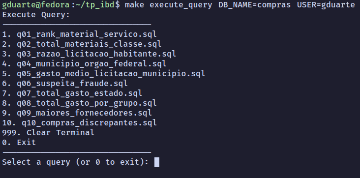
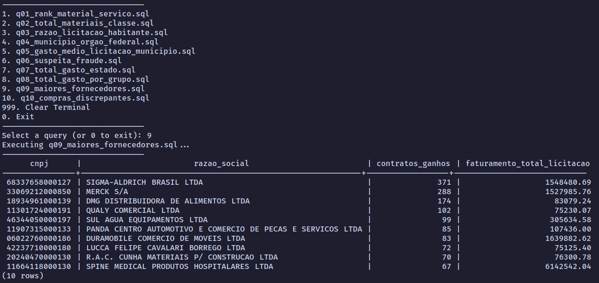

# Projeto Final: Introdução A Banco de Dados

## Introdução 

Esse projeto foi feito para cumprir com trabalho final
da disciplina de Introdução A Banco de Dados. O intuito do 
projeto era desenvolver um banco de dados utilizando alguma
base de dados real. A base de dados escolhida foi a de
**Compras Públicas do governo**.

## Como Instalar o Banco

Para conseguir rodar o banco localmente, primeiramente, é necessario 
ter instalado na sua máquina:

- SGBD Postgress
- Python 3
- Make

Depois de clonar o repositório execute:

```bash
pip install requirements.txt

```

Para criar e popular o banco de dados rode:

```bash 
make populate <nome_banco_de_dados> <nome_usuario> <password>
```

Após essas sequências de comandos o banco deve estar pronto para ser usado.

## Executar Queries Predefinidas

Algumas queries já foram implementadas e estão disponíveis para serem executadas. 
Um menu interativo foi criado para facilitar a execução das queries, para acessá-lo execute:

```bash
  make execute_query USER=<nome_usuario> DB_NAME=<nome_banco_de_dados>
```

Esse menu deve aparecer no terminal:



Para executar uma query digite o seu número e pressione enter.


